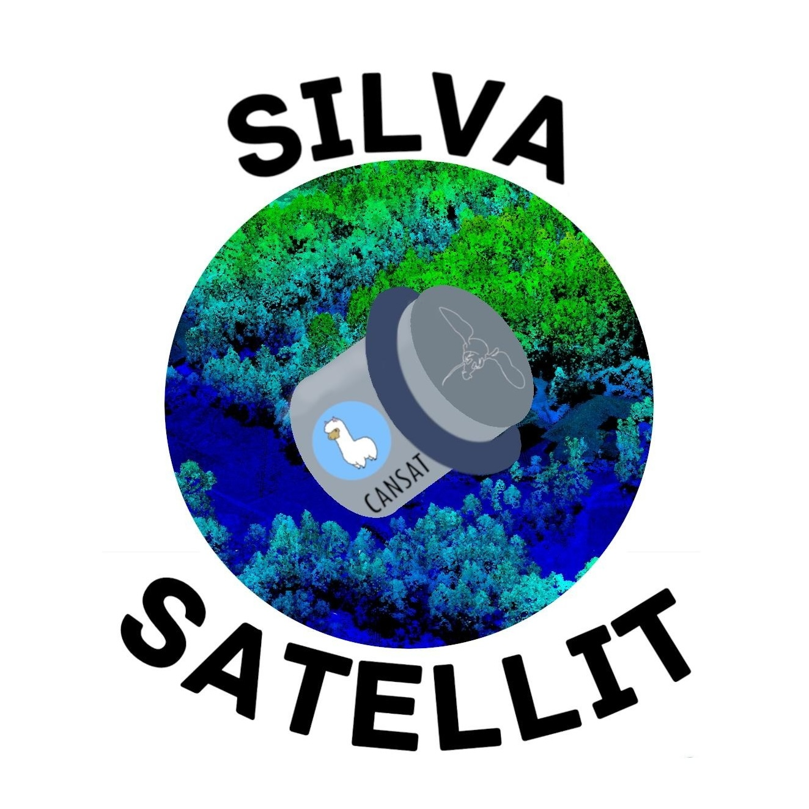

# Team Silva-Satellit

## Informationen

In diesem Respository ist der Sourcecode des Haupt-Mikrocontrollers, der im CanSat verbaut ist, zu finden. Dieser Controller ist für das Auslesen der Temperatur, Luftdruck, Luftfeutigkeit und Gyrodaten verantwortlich.
